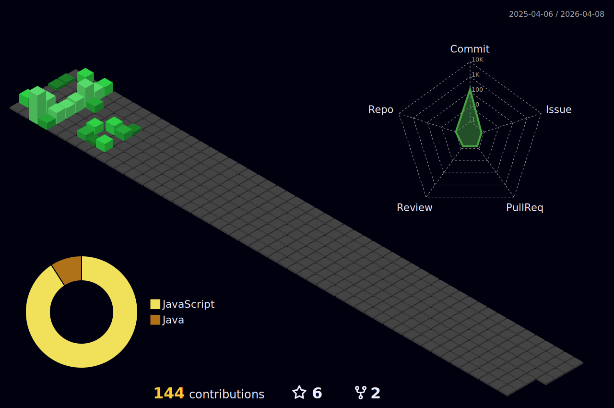

<p align = center >  </p>

<div align="center">
    </img>
  
  
  
  
  
  
  
</div>

<div>
<!---->
      
<h2> / about me /
  
  
  
  
  
</h2>
  
- :credit_card: My full name is **Lâm Thanh Anh Quân** 
- :school: I'm currently 3rd year student at **FPT University - Ho Chi Minh City Campus**
- :books: My major is **Software Engineering**
- :earth_asia: I'm living now in **Ho Chi Minh City, Viet Nam**
- :sweat_smile: I’m looking for with Internships, know C and Java language. Now I'm focus on learning **SAP Fiori** and **Coursera**.
- :monocle_face: I'm interested in coding, sleeping, and watching film
- :sunglasses: My quote is ***"It's never too late - never too late to start over, never too late to be happy"*** 
- :ok_hand: Fun fact: have problem :point_right: sleep, happy :point_right: sleep, sad :point_right: sleep ~~ everything :point_right: sleep
  
<h2> / current skills / </h2>

- <h4> languages </h4>
  
  
  
  
  
- <h4> frameworks & libraries </h4>
  
  
  
  
  
- <h4> designing tools </h4>
  
  
  
  
- <h4> databases </h4>
  
  

- <h4> devtools </h4>
  
  
  
  
  
  
  </br></br>
  <p align="center">
  
    
  <div align="center">
    
  [](https://spotify-github-profile.kittinanx.com/api/view?uid=31kowfrz2zyqarfjv63t4fl26o6y&redirect=true)
    <details>
    <summary>Recently played</summary>
    <a href="https://open.spotify.com/user/31kowfrz2zyqarfjv63t4fl26o6y"></a>
    </details>
  </div>

  <p align="center">
  

  <p align="center">
  

  <p align="center">
  

  <p align="center">
  

  <div align="center">
  
```diff
+@ @ @ @ @ @ @ @ @ @ @ @ @ @ @ @ @ @ @ @ @ @ @ @ @ @ @ @+
@@       o o                                           @@
@@       | |                                           @@
@@      _L_L_                                          @@
@@   ❮\/__-__\/❯ Programming isn't about what you know @@
@@   ❮(|~o.o~|)❯  It's about what you can figure out   @@
@@   ❮/ \`-'/ \❯                                       @@
@@     _/`U'\_                                         @@
@@    ( .   . )     .----------------------------.     @@
@@   / /     \ \    | while( ! (succed=try() ) ) |     @@
@@   \ |  ,  | /    '----------------------------'     @@
@@    \|=====|/                                        @@
@@     |_.^._|                                         @@
@@     | |"| |                                         @@
@@     ( ) ( )   Testing leads to failure              @@
@@     |_| |_|   and failure leads to understanding    @@
@@ _.-' _j L_ '-._                                     @@
@@(___.'     '.___)                                    @@
+@ @ @ @ @ @ @ @ @ @ @ @ @ @ @ @ @ @ @ @ @ @ @ @ @ @ @ @+
```
  
</div>

<p align="center">


<p align="center">

<b>FUN FACT EVERYDAY🤔 :</b>
<i>❝4004 was the name given to the first microprocessor by Intel.❞</i>
</p>

<p align="center">


<p align="center">


<p align="center">
</p>

<p align="center">


<p align="center">
<a href="https://github.com/trinib/AdGuard-WireGuard-Unbound-DNScrypt">

<div align="center">

 </div>

<div align="center">

 </div>

<p align="center">
<a href="https://stackoverflow.com/users/27397365/l%c3%a2m-thanh-anh-qu%c3%a2n?tab=profile">
  

<p align="center">
  <a href="https://github.com/quanlta?tab=stars&sort=stargazers">
    </a>
  
<a href="https://github.com/quanlta?tab=followers">
    </a>
  
<p align="center">

  



<p align="center">


<p align="center">


<p align="center">


<p align="center">


<p align="center">


<p align="center">

<p align="center">

<p align="center">
<br><br>

<p align="center">


<p align="center">


<p align="center">


<p align="center">


<h3 align="center">
📛Github Usernames📛 
</br> 


<!--📏LINE-->

<p align="center">

<!--🐱CAT-->
<p align="center">


<!--🤔INTERESTTITLE-->
<p align="center">


<!--🖼️🖼️INTERSTLOGOS-->
<p align="center">


</h4>

<!--🖼️⭐🔱STARRED/FORK-->
<h4 align="right">
 
<table>
  <tr>
   
   &nbsp;&nbsp;&nbsp;&nbsp;&nbsp;&nbsp;&nbsp;&nbsp;&nbsp;&nbsp;&nbsp;&nbsp;&nbsp;&nbsp;&nbsp;&nbsp;&nbsp;&nbsp;&nbsp;
   &nbsp;&nbsp;&nbsp;&nbsp;&nbsp;&nbsp;&nbsp;&nbsp;&nbsp;&nbsp;&nbsp;&nbsp;&nbsp;&nbsp;
  </tr>
  <tr>
    <td><p align="center"><a href="https://github.com/quanlta?tab=stars"><b>MY STARRED REPOS <br>AND TOPICS</b></a>
    <td><p align="center"><a href="https://github.com/quanlta/quanlta/edit/main/README.md"><b>FORK PROFILE WITH <br>EASY EDITING</b></a>
  </tr>
 </table>
 
<p align="center">


<h4 align="left">
</h4>
 
╔═&nbsp;&nbsp;👀 𝕐&nbsp;𝕆&nbsp;𝕌&nbsp;ℝ&nbsp;&nbsp;𝕋&nbsp;ℍ&nbsp;𝔼&nbsp;𝕄&nbsp;𝔼&nbsp;&nbsp;𝕄&nbsp;𝕆&nbsp;𝔻&nbsp;𝔼 👀
<h4>
<h4 align="left">  
 
╚═════ &nbsp;𝐈𝐓'𝐒 [𝐃𝐀𝐑𝐊⚫](https://github.com/settings/appearance#gh-dark-mode-only)[𝐁𝐑𝐈𝐆𝐇𝐓⚪](https://github.com/settings/appearance#gh-light-mode-only) 𝐈𝐍 𝐇𝐄𝐑𝐄...
<h4>
  
<p align="left">
&nbsp;&nbsp;&nbsp;&nbsp;&nbsp;&nbsp;&nbsp;&nbsp;&nbsp;&nbsp;&nbsp;&nbsp;&nbsp;&nbsp;&nbsp;&nbsp;&nbsp;&nbsp;&nbsp;&nbsp;&nbsp;&nbsp;&nbsp;&nbsp;&nbsp;&nbsp;&nbsp;&nbsp;&nbsp;&nbsp;&nbsp;&nbsp;&nbsp;&nbsp;&nbsp;&nbsp;&nbsp;&nbsp;&nbsp;&nbsp;&nbsp;&nbsp;&nbsp;&nbsp;&nbsp;&nbsp;&nbsp;&nbsp;&nbsp;&nbsp;&nbsp;&nbsp;&nbsp;&nbsp;&nbsp;&nbsp;&nbsp;&nbsp;&nbsp;&nbsp;&nbsp;&nbsp;&nbsp;&nbsp;&nbsp;&nbsp;&nbsp;&nbsp;&nbsp;&nbsp;&nbsp;&nbsp;&nbsp;&nbsp;&nbsp;&nbsp;&nbsp;&nbsp;&nbsp;&nbsp;&nbsp;&nbsp;&nbsp;&nbsp;&nbsp;&nbsp;&nbsp;&nbsp;&nbsp;&nbsp;&nbsp;&nbsp;&nbsp;&nbsp;&nbsp;&nbsp;&nbsp;&nbsp;&nbsp;&nbsp;&nbsp;&nbsp;&nbsp;&nbsp;&nbsp;&nbsp;&nbsp;&nbsp;&nbsp;&nbsp;&nbsp;&nbsp;
 


------
<p align="right">
<a href="#top">
<picture>
  <source media="(prefers-color-scheme: dark)" srcset="https://raw.githubusercontent.com/danielcshn/danielcshn/master/icons/arrow-square-up-fac539.svg">
  
</picture>
</a>
</p>

<div align="right">
  <p align="center">
<a href="https://github.com/quanlta/quanlta/graphs/contributors">
  
</a>
<p>
<i>Last Edited on:</i> : <b>9/21/2024</b>
  
Credit: [quanlta](https://github.com/quanlta)
</p>
</div>


