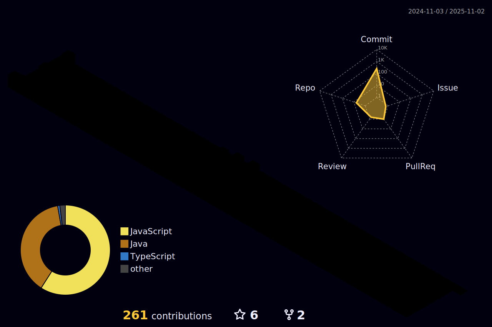

<h2 align="center">
  Welcome to quanlta's profile!
  
</h2>

## 👨‍💻 Technology Stack

<!-- https://github.com/tandpfun/skill-icons -->

  
<!-- 

 -->
 

## 🎧 Spotify Playing

<!-- https://github.com/kittinan/spotify-github-profile -->

    
Recently played

    

## 🏆GitHub Trophies

  

## 📈 Github stats

  

  

  

<!-- https://github.com/yoshi389111/github-profile-3d-contrib -->
<!-- <a href="https://github.com/yoshi389111/github-profile-3d-contrib">
<picture>
  <source media="(prefers-color-scheme: dark)" srcset="https://raw.githubusercontent.com/danielcshn/danielcshn/master/profile-3d-contrib/profile-night-view.svg">
  
</picture>
</a> -->

<!-- https://github.com/ashutosh00710/github-readme-activity-graph 
<a href="https://github.com/ashutosh00710/github-readme-activity-graph">
<picture>
  <source media="(prefers-color-scheme: dark)" srcset="https://github-readme-activity-graph.vercel.app/graph/?username=quanlta&bg_color=00000f&color=007bff&line=fac539&point=FFFFFF&hide_border=true">
  
</picture>
</a>
-->
<!-- Specify theme context for images in Markdown (Beta): https://github.blog/changelog/2022-05-19-specify-theme-context-for-images-in-markdown-beta/ -->
<!-- 

   
  
   

 -->

<!-- Back to Top -->
<!-- Arrow Square Up SVG Vector
COLLECTION: Dazzle Line Icons
LICENSE: CC Attribution License
AUTHOR: Dazzle UI
URL: https://www.svgrepo.com/svg/533629/arrow-square-up
 -->

<a href="#top">
<picture>
  <source media="(prefers-color-scheme: dark)" srcset="https://raw.githubusercontent.com/danielcshn/danielcshn/master/icons/arrow-square-up-fac539.svg">
  
</picture>
</a>

