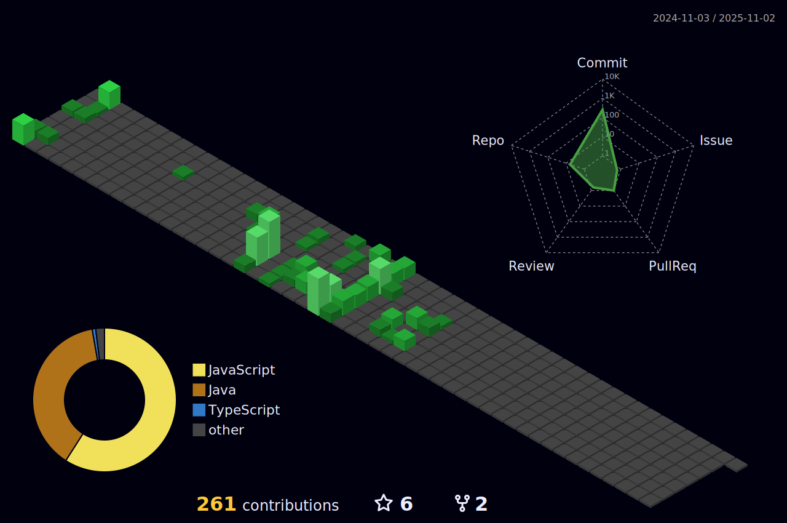

<h2 align="center">
  Welcome to my profile!
  
</h2>

## 👨‍💻 Technology Stack

## 🎧 Spotify Playing

    
Recently played

    

## 🏆GitHub Trophies

  

## 📈 Github stats

  

  

  

<a href="#top">
<picture>
  <source media="(prefers-color-scheme: dark)" srcset="https://raw.githubusercontent.com/danielcshn/danielcshn/master/icons/arrow-square-up-fac539.svg">
  
</picture>
</a>

